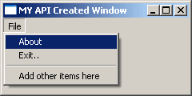



## API Created Form

### Description

Hi this is to show a beginner how to create a new Window just using Pure API Code. the code features an API Message Box and also a API Created Menu. anyway Hope you may find this usfull in some way.
 
### More Info
 

             |
---                |---
**Submitted On**   |2005-03-15 13:45:38
**By**             |[dreamvb](https://github.com/Planet-Source-Code/PSCIndex/blob/master/ByAuthor/dreamvb.md)
**Level**          |Beginner
**User Rating**    |4.9 (54 globes from 11 users)
**Compatibility**  |VB 6\.0
**Category**       |[Miscellaneous](https://github.com/Planet-Source-Code/PSCIndex/blob/master/ByCategory/miscellaneous__1-1.md)
**World**          |[Visual Basic](https://github.com/Planet-Source-Code/PSCIndex/blob/master/ByWorld/visual-basic.md)
**Archive File**   |[API\_Create1864703152005\.zip](https://github.com/Planet-Source-Code/dreamvb-api-created-form__1-59487/archive/master.zip)

